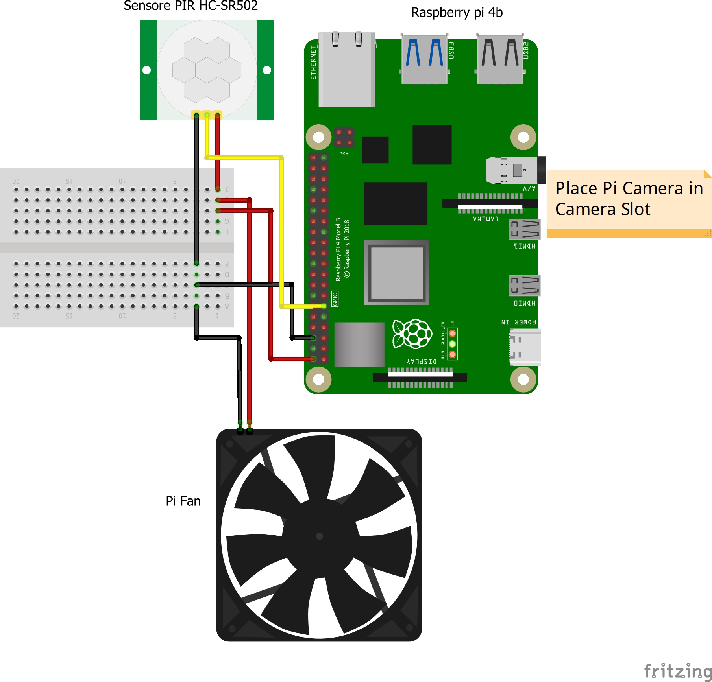

# Home Intruder Detection System with Raspberry Pi

This project describes a simple Home Intruder Detection System using a Raspberry Pi 4B kit, a PIR (Passive Infrared) sensor, and a Pi Camera v2.1. When an intruder is detected, the system records a 5-second video and sends it via email and Telegram notifications.

## Components Used
- Raspberry Pi 4B Kit
- PIR Sensor
- Pi Camera v2.1

## Prerequisites
- Raspberry Pi OS installed on your Raspberry Pi.
- Python 3.8 and above installed on your Raspberry Pi.
- Internet connectivity on your Raspberry Pi.
- A Gmail account for sending emails.
- A Telegram bot and chat ID for sending Telegram notifications.

## Wiring Diagram


## Installation and Setup

1. Clone or download this repository to your Raspberry Pi.

2. Install the required Python packages:


```bash
pip install picamera python-telegram-bot secure-smtplib

```

3. Configure the system:
- Update the email and Telegram settings in the `security_system.py` file.

4. Run the system:

```bash
python security_system.py

```


## Usage

1. Place the PIR sensor in the area you want to monitor.

2. Run the system using the `security_system.py` script.

3. When an intruder is detected, the system will capture a 5-second video and send it via email and Telegram notifications.

## Customization

You can customize the behavior of the system by modifying the `security_system.py` file. For example, you can change the email subject, message, and recipients, or adjust the Telegram bot settings.

## Contributing

If you'd like to contribute to this project, please fork the repository and submit a pull request. Feel free to open issues for any suggestions or improvements.

## License

This project is licensed under the MIT License - see the [LICENSE](LICENSE)
